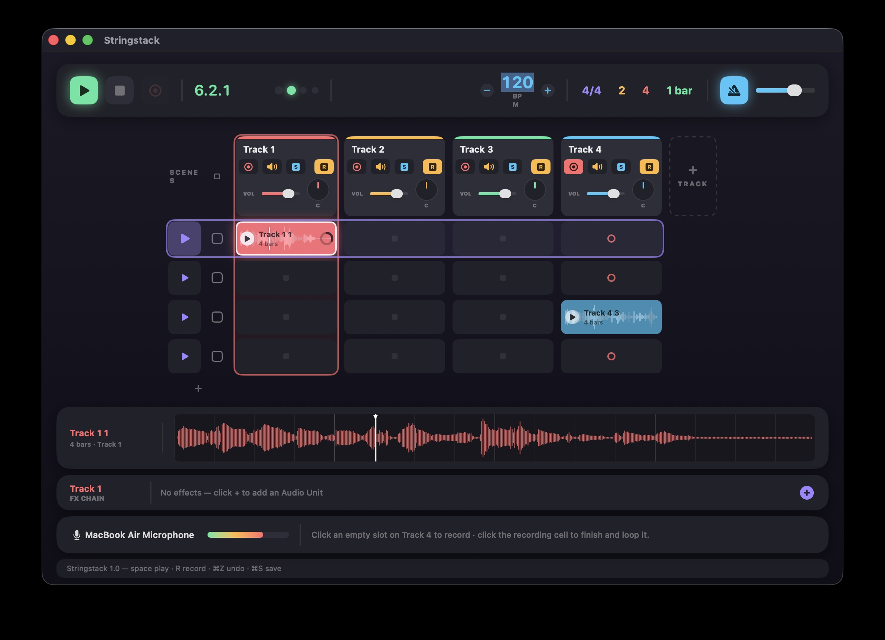

# Stringstack

A simple, colourful loop-based audio DAW for macOS, inspired by the **Session view** of Ableton Live. Build up a track by recording and launching audio loops in a clip grid, layer effects, and jam — all from a single screen.

Stringstack is written in **SwiftUI** on top of **AVAudioEngine**, and hosts **Audio Unit (AU) effect plugins**.



---

## What it does

Stringstack is organised around a **clip grid**: tracks are columns, scenes are rows, and each cell holds one audio loop.

- **Record loops** from the built-in microphone or any external Core Audio input, with a metronome and count-in.
- **Launch clips** quantised to the bar, so everything you trigger stays in time.
- **Layer takes** with per-track overdub, or replace them.
- **Mix** with per-track volume, pan, mute, and exclusive solo.
- **Add AU effects** to any track, with the plugin's own editor UI.
- **Save** your work as a self-contained project you can reopen later.

There is no linear arrangement/timeline — Stringstack is deliberately focused on the live, loop-launching clip view.

---

## Requirements

- macOS 15 (Sequoia) or later
- Xcode 16 or later to build (developed against Xcode 26)
- A microphone (built-in or external interface) for recording

---

## Building & running

Open `Stringstack.xcodeproj` in Xcode and run, or from the command line:

```bash
xcodebuild -project Stringstack.xcodeproj -scheme Stringstack -configuration Debug -allowProvisioningUpdates build
```

The first time you record, macOS will ask for **microphone permission** — approve it. On first launch the app loads a small **demo set** (drums, bass, keys, shaker) so there's something to play with immediately.

---

## The interface

From top to bottom:

1. **Transport bar** — play/stop/record, position readout with beat dots, tempo, time signature, count-in, record length, quantise, and metronome controls.
2. **Clip grid** — a numbered scene launch/stop column plus one column per track. Each track header is a mini channel strip (arm, mute, solo, overdub mode, volume, pan knob, and a stereo VU meter).
3. **Clip inspector** — the selected clip's waveform with a bar/beat grid and a follow line that tracks playback.
4. **FX chain bar** — the selected track's Audio Unit effect chain.
5. **Input bar** — the recording input device picker, a live input meter with an input-level slider, and the master output meter + fader.
6. **Status bar** — messages, errors, and a shortcut hint.

### Selection cues

Clicking anywhere on a cell selects it — track (x) and scene (y) — and drives what recording and Delete act on. On launch, track 1 and scene 1 are selected.

- **Coloured box around a column** — the selected track (its FX chain is shown, and ⌥ shortcuts target it).
- **Violet box around a row** — the selected scene (its launch triangle pulses with the beat while playing).
- **White outline on a cell** — the selected clip/cell (the target for the record button and the Delete key).

---

## Transport & timing

- **Play / Stop** — `Space`. Play launches the currently **selected scene** (all clips in that row); Play again stops.
- **Record** — `R`. Only enabled when the selected track is armed (the record button greys out otherwise).
- **Tempo** — type a BPM into the field, use the −/+ steppers, or drag the number up/down (20–300 BPM).
- **Time signature** — 2/4 through 7/4.
- **Count-in** — off, 1, 2 (default), or 4 bars of clicks before recording starts.
- **REC BARS** — fixed recording length (1, 2, 4 (default), 8) or *Free*. With a fixed length the take auto-finishes after that many bars and immediately continues looping; *Free* records until you stop.
- **Quantise** — clip launches snap to *None*, *1 Beat*, or *1 Bar* (default).
- **Metronome** — toggle on/off and set its volume. The click always sounds during count-in, and is automatically muted **while recording** so it doesn't bleed into the take.

The metronome doubles as the transport's sample-accurate clock, so clicks, count-in, clip launches, and recording all share one timeline.

---

## Tracks

Each track column has a header with:

- **Name** — click the header to select the track; right-click to delete it.
- **Arm** (●) — arm the track for recording. Only one track is armed at a time.
- **Mute** — silence the track.
- **Solo** — exclusive: silences every other track so only this one plays.
- **o / r** — record mode when recording into a cell that **already has a clip** (styled like the solo button, showing the active letter):
  - **o** (Overdub) — the existing clip plays and your new take is layered on top, keeping the same length.
  - **r** (Replace) — the existing clip is cleared and re-recorded from scratch.
- **Volume** slider and a rotary **Pan** knob (drag to turn, double-click to re-centre).
- **Stereo VU meter** — post-fader, so the volume slider controls it and it reflects the pan knob.

Add a track with the **+ TRACK** button; add a scene row with the **+** under the scene column.

### Scenes

Scene rows are numbered consecutively (1, 2, 3…) down the left, and the numbers stay consecutive after any duplicate, delete, or reorder.

- **Reorder** — drag a scene number up or down; the whole row (all tracks) moves with it.
- **Right-click a scene number** — Duplicate Scene (copies the whole row into a new scene below) or Delete Scene. Both are undoable.
- The grid can be emptied of scenes entirely and rebuilt with **+**.

---

## Recording a loop

1. **Arm** a track (●). Only one track is armed at a time. The first arm configures the mic input and may prompt for permission.
2. **Select** the cell you want to record into (click it). The record button lights up once the selected track is armed.
3. Press the **record button** (or **`R`**). Recording only ever starts from the record button — clicking a cell just selects it, it never starts recording. It records into the selected cell (or the armed track's first empty slot if no cell on that track is selected).
4. After the **count-in**, play your part. With a fixed **REC BARS** length it stops automatically and starts looping; otherwise press **Stop** (or click the recording cell) to finish.

During the count-in the position readout shows a plain bar countdown (e.g. `2` then `1`). Takes are trimmed to whole bars and aligned to the beat, so loops line up even if your timing isn't exact. If you stop early, a fixed-length clip is still created at the chosen length (silence-padded).

Recording into an occupied cell uses that track's **o / r** mode (overdub or replace). *Tip: for a clean overdub, monitor on headphones so the existing loop doesn't bleed back into the mic.*

---

## Playing clips

- **Launch a clip** — click its ▶ button. It starts at the next quantise boundary and loops. A vertical **follow line** sweeps its waveform while it plays (both in the cell and in the clip inspector).
- **Select a clip** — click anywhere else on the cell (white outline). `Delete` removes the selected clip.
- **Launch a scene** — click the ▶ in the scene column to fire that whole row. The main Play button also launches the currently selected scene, and the selected scene's ▶ pulses with the beat.
- **Stop** — each scene row has a clear (outlined) **■ square** to the right of its ▶ that flashes when clicked and stops everything, exactly like the main Stop button. You can also stop a single track's clip by clicking an empty cell on that track while it plays.
- **Move a clip** — drag it to another cell (clips swap).
- **Duplicate a clip** — `⌘D` (or right-click ▸ Duplicate) copies the clip into the scene below, inserting a scene if needed.
- **Import audio** — drag an audio file from Finder onto a cell.
- **Rename / recolour / delete** — right-click a clip.

---

## Effects (Audio Units)

The **FX chain bar** shows the selected track's insert-effect chain.

- Click **+** to browse the installed AU effects on your Mac (searchable).
- Each effect appears as a chip: a **power** button to bypass, the **name** (click to open the plugin's editor window), **◀ ▶** to reorder, and **✕** to remove.
- Plugins with their own UI open in a floating window; those without get a generic slider-per-parameter editor.
- Effect chains and their settings are saved with the project.

Effects process **after** the players and **before** the track fader/pan, so volume, pan, and metering are post-effects.

---

## Projects

Projects are saved as self-contained **`.stringstackproj`** bundles (a folder holding the settings plus a copy of every clip's audio).

- **New Project** — `⌘N` (prompts to save first if you have unsaved changes)
- **Open** — `⌘O`
- **Save** — `⌘S` (Save As — `⇧⌘S`)
- **Load Demo Set** — from the File menu

The current project **autosaves** every couple of minutes once it has been saved at least once, and the **last-opened project reopens automatically** the next time you launch the app.

Input gain, metronome on/off, and metronome volume are remembered as app preferences across launches (they aren't stored per-project).

---

## Keyboard shortcuts

| Action | Shortcut |
| --- | --- |
| Play / Stop | `Space` |
| Record | `R` |
| New project | `⌘N` |
| Open project | `⌘O` |
| Save | `⌘S` |
| Save As | `⇧⌘S` |
| Undo / Redo | `⌘Z` / `⇧⌘Z` |
| Duplicate selected clip | `⌘D` |
| Delete selected clip | `Delete` (or `⌘⌫`) |
| Arm selected track | `⌥A` |
| Mute selected track | `⌥M` |
| Solo selected track | `⌥S` |

---

## Notes & limitations

- **AU effects only** — VST plugins are not supported.
- **No time-stretching** — clips play back at the tempo they were recorded at. Changing the tempo afterwards will make existing clips drift against the grid.
- **One input at a time** — a single track is armed for recording, matching the single audio input.
- Switching the input device takes effect the next time recording starts from a stopped transport.

---

## Development

Run the unit tests from Xcode (⌘U) or the command line:

```bash
xcodebuild test -project Stringstack.xcodeproj -scheme Stringstack -destination 'platform=macOS'
```

The `StringstackTests` target covers the pure, engine-independent logic — the
transport/beat maths (`BeatMath`: launch quantisation, recorded-bar rounding,
scene-reorder index mapping), host-time conversions (`HostClock`), buffer
maths (`AudioUtil` mix/slice/convert and `Waveform` peaks), and the
`.stringstackproj` Codable schema round-trip. This logic is deliberately
separated from the audio engine so the tests run fast and headless.

---

*Stringstack — record, launch, layer, jam.* 🎛️
